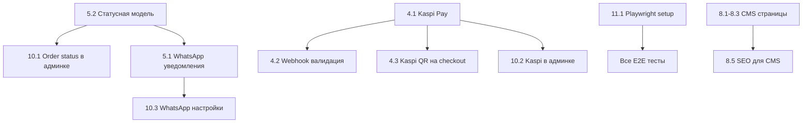

# Paradise.kz — MVP Audit: Задачи + Сценарии Тестирования

> Полный аудит проекта на 2026-07-23. Каждый модуль содержит:
> - **Текущее состояние** — что уже реализовано
> - **Задачи на доработку** — с приоритетами P0 (блокер MVP), P1 (важно), P2 (желательно)
> - **Сценарии тестирования** — Backend (PHPUnit) + Frontend (Playwright E2E)

---

## Содержание

1. [Auth (B2C OTP + B2B)](#1-auth-b2c-otp--b2b)
2. [Каталог (public + B2B)](#2-каталог-public--b2b)
3. [Продукт](#3-продукт)
4. [Корзина + Checkout](#4-корзина--checkout)
5. [Заказы](#5-заказы)
6. [B2B портал](#6-b2b-портал)
7. [Личный кабинет (B2C)](#7-личный-кабинет-b2c)
8. [CMS-страницы](#8-cms-страницы)
9. [МойСклад интеграция](#9-мойсклад-интеграция)
10. [Filament админка](#10-filament-админка)
11. [Инфраструктура и продакшн](#11-инфраструктура-и-продакшн)

---

## Сводка задач

| Приоритет | Количество | Описание |
|-----------|-----------|----------|
| **P0** | 8 | Блокеры MVP — без них запуск невозможен |
| **P1** | 12 | Важно для полноценного UX — запуск возможен, но с ограничениями |
| **P2** | 9 | Желательно — улучшают качество, но не блокируют |

---

## 1. Auth (B2C OTP + B2B)

### Текущее состояние

- ✅ B2B: register/login/me/logout через email+password (Sanctum tokens)
- ✅ B2C: OTP по телефону (request + verify), `OtpService` с throttling
- ✅ Middleware: `EnsureApproved`, `b2b`
- ✅ Тесты: `AuthTest.php` (7+ кейсов), `OtpAuthTest.php`, `RetailCannotAccessB2bTest.php`

### Задачи

| # | Задача | Приоритет | Файлы |
|---|--------|-----------|-------|
| 1.1 | **OTP rate-limiting по IP** — текущий throttle `5,1` и `10,1` на роутах, но нет теста что лимит работает корректно | P1 | `routes/api.php`, тесты |
| 1.2 | **Восстановление сессии B2C** — при протухшем токене фронт не показывает ошибку, просто разлогинивает. Добавить toast/redirect | P2 | `storefront/src/lib/api.ts`, middleware |
| 1.3 | **Валидация телефона** — формат `+7XXXXXXXXXX` не валидируется на фронте при OTP-запросе | P1 | `storefront/src/app/[locale]/login/page.tsx` |

### Сценарии тестирования

#### Backend (PHPUnit Feature)

```
tests/Feature/Auth/
├── AuthTest.php                    ✅ Существует
├── RetailCannotAccessB2bTest.php   ✅ Существует
└── OtpAuthTest.php (в PublicAuth/) ✅ Существует
```

**Недостающие тест-кейсы (добавить в существующие файлы):**

| # | Сценарий | Файл | Тип |
|---|----------|------|-----|
| T1.1 | B2B register → login → получить token → доступ к `/products` | `AuthTest.php` | Feature |
| T1.2 | B2B login с неверным паролем → 401 | `AuthTest.php` | Feature |
| T1.3 | B2B register с дублирующим email → 422 | `AuthTest.php` | Feature |
| T1.4 | Неодобренный B2B клиент → GET `/products` → 403 | `AuthTest.php` | Feature |
| T1.5 | OTP request → verify → получить token → доступ к `/account/me` | `OtpAuthTest.php` | Feature |
| T1.6 | OTP verify с неверным кодом → 422 | `OtpAuthTest.php` | Feature |
| T1.7 | OTP verify с истёкшим кодом → 422 | `OtpAuthTest.php` | Feature |
| T1.8 | Retail-токен → GET `/products` (B2B) → 403 | `RetailCannotAccessB2bTest.php` | Feature |
| T1.9 | Logout → повторное использование токена → 401 | `AuthTest.php` | Feature |

#### Frontend (Playwright E2E)

| # | Сценарий | Путь |
|---|----------|------|
| E1.1 | B2C: ввести телефон → получить код → войти → увидеть кабинет | `/login` |
| E1.2 | B2C: ввести некорректный телефон → ошибка валидации | `/login` |
| E1.3 | B2C: неверный OTP код → ошибка | `/login` |
| E1.4 | B2B: ввести email+пароль → войти → каталог | `/b2b/login` |
| E1.5 | B2B: регистрация → pending page | `/b2b/register` → `/b2b/pending` |

---

## 2. Каталог (public + B2B)

### Текущее состояние

- ✅ Public API: `/public/products` (фильтры, сортировка, пагинация), `/public/categories`, `/public/facets`
- ✅ B2B API: `/products` с visibility + per-client pricing
- ✅ Frontend B2C: `CatalogView`, `FilterSidebar`, `SortSelect`, `Pagination`, `CategoryIcons`, `MegaMenu`
- ✅ Frontend B2B: `B2BCatalogView`
- ✅ Тесты: `CatalogApiTest.php`, `PublicCatalogTest.php`, `ProductFiltersTest.php`, `FacetsTest.php`, `VisibilityServiceTest.php`

### Задачи

| # | Задача | Приоритет | Файлы |
|---|--------|-----------|-------|
| 2.1 | **Поиск — пустой результат**: при пустом результате поиска нет подсказок "Попробуйте другие слова" | P2 | `CatalogView.tsx` |
| 2.2 | **Категории — breadcrumbs на мобильном**: проверить что breadcrumbs не обрезаются | P2 | `Breadcrumbs.tsx` |
| 2.3 | **Фильтры — мобильная версия**: FilterSidebar должен закрываться при навигации | P2 | `FilterSidebar.tsx` |

### Сценарии тестирования

#### Backend (PHPUnit Feature)

| # | Сценарий | Файл | Тип |
|---|----------|------|-----|
| T2.1 | GET `/public/products` без фильтров → пагинированный список | `PublicCatalogTest.php` | Feature |
| T2.2 | GET `/public/products?category=furniture` → только товары категории | `ProductFiltersTest.php` | Feature |
| T2.3 | GET `/public/products?search=стол` → текстовый поиск по имени | `ProductFiltersTest.php` | Feature |
| T2.4 | GET `/public/products?sort=-price` → сортировка по цене убыв. | `ProductFiltersTest.php` | Feature |
| T2.5 | GET `/public/products?brand=X` → фильтр по бренду | `ProductFiltersTest.php` | Feature |
| T2.6 | GET `/public/products?price_min=1000&price_max=5000` → фильтр по цене | `ProductFiltersTest.php` | Feature |
| T2.7 | GET `/public/facets?category=furniture` → фасеты с правильными counts | `FacetsTest.php` | Feature |
| T2.8 | GET `/public/categories` → дерево категорий с children | `PublicCatalogTest.php` | Feature |
| T2.9 | GET `/public/categories/{slug}` → категория с breadcrumb | `CategoryDetailTest.php` | Feature |
| T2.10 | B2B: GET `/products` → видит только разрешённые товары (visibility) | `CatalogApiTest.php` | Feature |
| T2.11 | B2B: GET `/products` → цены = per-client price (не retail) | `CatalogApiTest.php` | Feature |
| T2.12 | B2B: товар скрыт через override → не виден в списке | `VisibilityServiceTest.php` | Feature |
| T2.13 | B2B: товар в группе, клиент не в группе → не виден | `VisibilityServiceTest.php` | Feature |
| T2.14 | Неактивный товар (`is_active=false`) → не виден нигде | `PublicCatalogTest.php` | Feature |
| T2.15 | Товар без цены → не показывается в публичном каталоге | `PublicCatalogTest.php` | Feature |

#### Frontend (Playwright E2E)

| # | Сценарий | Путь |
|---|----------|------|
| E2.1 | Главная → клик по категории → каталог с фильтром | `/` → `/catalog/[slug]` |
| E2.2 | Каталог → применить фильтр по бренду → URL обновляется | `/catalog` |
| E2.3 | Каталог → фильтр по цене → товары в диапазоне | `/catalog` |
| E2.4 | Каталог → поиск "стол" → результаты | `/search?q=стол` |
| E2.5 | Каталог → пагинация → следующая страница | `/catalog?page=2` |
| E2.6 | Каталог → мобильный вид → фильтры в drawer | `/catalog` (viewport 375px) |
| E2.7 | Каталог → сортировка по цене → порядок меняется | `/catalog` |

---

## 3. Продукт

### Текущее состояние

- ✅ Public API: `/public/products/{slug}` — детальная страница с характеристиками, вариантами, изображениями
- ✅ Frontend: `ProductGallery`, `ProductCard`, `AddToCartButton`, `FavoriteButton`, `InStockChip`, `StarRating`
- ✅ Тесты: `ProductSlugTest.php`

### Задачи

| # | Задача | Приоритет | Файлы |
|---|--------|-----------|-------|
| 3.1 | **Варианты на детальной странице** — проверить что выбор варианта меняет цену и наличие | P1 | `storefront/src/app/[locale]/product/[slug]/page.tsx` |
| 3.2 | **SEO: meta description и title** для страницы товара из данных продукта | P1 | `product/[slug]/page.tsx` |
| 3.3 | **Structured data (JSON-LD)** — Product schema для Google | P2 | `product/[slug]/page.tsx` |

### Сценарии тестирования

#### Backend (PHPUnit Feature)

| # | Сценарий | Файл | Тип |
|---|----------|------|-----|
| T3.1 | GET `/public/products/{slug}` → полные данные: images, characteristics, variants, brand | `ProductSlugTest.php` | Feature |
| T3.2 | GET `/public/products/{id}` (числовой id) → тоже работает | `ProductSlugTest.php` | Feature |
| T3.3 | GET `/public/products/nonexistent-slug` → 404 | `ProductSlugTest.php` | Feature |
| T3.4 | Продукт с вариантами → каждый вариант имеет stock и in_stock | NEW `ProductVariantTest.php` | Feature |
| T3.5 | Продукт без изображений → возвращает пустой `images[]` | `ProductSlugTest.php` | Feature |
| T3.6 | Продукт с `compare_at_price` → `old_price` в ответе | `ProductSlugTest.php` | Feature |
| T3.7 | Продукт с `is_new_arrival=true` → `is_new=true` в ответе | `ProductSlugTest.php` | Feature |

#### Frontend (Playwright E2E)

| # | Сценарий | Путь |
|---|----------|------|
| E3.1 | Открыть продукт → галерея работает (листание) | `/product/[slug]` |
| E3.2 | Продукт в наличии → кнопка "Добавить в корзину" активна | `/product/[slug]` |
| E3.3 | Продукт не в наличии → кнопка неактивна, показан badge | `/product/[slug]` |
| E3.4 | Добавить в избранное (залогинен) → сердечко закрашено | `/product/[slug]` |
| E3.5 | Добавить в корзину → badge на иконке корзины обновляется | `/product/[slug]` |

---

## 4. Корзина + Checkout

### Текущее состояние

- ✅ Backend: `POST /public/cart/validate`, `POST /public/checkout` (guest + retail auth)
- ✅ `OrderPlacementService` с полным flow: visibility check → stock check → FIFO inventory → price snapshot
- ✅ Frontend B2C: cart page, checkout page, checkout success
- ✅ Kaspi webhook stub: `KaspiWebhookController` — принимает `order_id` + `status=paid`
- ✅ `payment_method` и `payment_status` поля на Order
- ✅ Тесты: `CartValidateTest.php`, `GuestCheckoutTest.php`, `RetailCheckoutTest.php`

### Задачи

| # | Задача | Приоритет | Файлы |
|---|--------|-----------|-------|
| 4.1 | **P0: Kaspi Pay — полная интеграция** | P0 | Описание ниже |
| 4.2 | **Валидация Kaspi webhook** — добавить проверку подписи/IP whitelist | P0 | `KaspiWebhookController.php` |
| 4.3 | **Checkout — показать Kaspi QR/ссылку** на странице оплаты | P0 | `checkout/page.tsx`, `checkout/success/page.tsx` |
| 4.4 | **Минимальная сумма заказа** — если настроена в CatalogSettings | P1 | `OrderPlacementService.php`, `checkout/page.tsx` |
| 4.5 | **Пустая корзина → redirect** — на фронте при пустой корзине на checkout показывается flash | P2 | `checkout/page.tsx` |

#### 4.1 Kaspi Pay — детали задачи

Что нужно реализовать:

1. **`config/services.php`** — добавить `kaspi.payment_base_url`, `kaspi.webhook_secret`, `kaspi.merchant_id`
2. **`KaspiWebhookController`** — проверять подпись запроса (HMAC или IP whitelist), обрабатывать статусы `paid`, `cancelled`, `failed`
3. **Checkout response** — возвращать `payment_url` для Kaspi Pay (уже начато, но `config('services.kaspi.payment_base_url')` не настроен)
4. **Frontend** — при `payment_method === 'kaspi'` показать ссылку/QR и инструкцию на странице success
5. **Тест** — webhook с валидной подписью обновляет `payment_status`, с невалидной → 403

### Сценарии тестирования

#### Backend (PHPUnit Feature)

| # | Сценарий | Файл | Тип |
|---|----------|------|-----|
| T4.1 | `POST /public/cart/validate` с валидными items → цены, subtotal, delivery_cost | `CartValidateTest.php` | Feature |
| T4.2 | `POST /public/cart/validate` с несуществующим product_id → исключается как unavailable | `CartValidateTest.php` | Feature |
| T4.3 | `POST /public/cart/validate` товар без цены → `problem: no_price` | `CartValidateTest.php` | Feature |
| T4.4 | `POST /public/cart/validate` товар с недостаточным stock → `problem: insufficient_stock` | `CartValidateTest.php` | Feature |
| T4.5 | Guest checkout (pickup) → 201, order created, number формата `P-XXXXXX` | `GuestCheckoutTest.php` | Feature |
| T4.6 | Guest checkout (delivery) → delivery_cost рассчитан, адрес сохранён | `GuestCheckoutTest.php` | Feature |
| T4.7 | Guest checkout → stock декрементирован (FIFO) | `GuestCheckoutTest.php` | Feature |
| T4.8 | Guest checkout → товар не виден → 422 | `GuestCheckoutTest.php` | Feature |
| T4.9 | Guest checkout → stock = 0 → 422 | `GuestCheckoutTest.php` | Feature |
| T4.10 | Retail checkout (auth) → order принадлежит пользователю | `RetailCheckoutTest.php` | Feature |
| T4.11 | Retail checkout с saved address_id → адрес скопирован в order | `RetailCheckoutTest.php` | Feature |
| T4.12 | Kaspi webhook (`status=paid`) → order.payment_status = 'paid' | NEW `KaspiWebhookTest.php` | Feature |
| T4.13 | Kaspi webhook с невалидным order_id → 404 | NEW `KaspiWebhookTest.php` | Feature |
| T4.14 | Kaspi webhook без auth/подписи → 403 | NEW `KaspiWebhookTest.php` | Feature |
| T4.15 | Checkout с `payment_method=kaspi` → response содержит `payment_url` | `GuestCheckoutTest.php` | Feature |
| T4.16 | B2B checkout (через `/orders`) → stock декрементирован, per-client price в order_items | `OrderApiTest.php` | Feature |
| T4.17 | B2B checkout → товар не виден клиенту → 422 | `OrderApiTest.php` | Feature |
| T4.18 | B2B checkout → нет цены для товара → 422 | `OrderApiTest.php` | Feature |

#### Backend (PHPUnit Unit)

| # | Сценарий | Файл | Тип |
|---|----------|------|-----|
| T4.U1 | `DeliveryCostCalculator::costFor()` — subtotal < free_delivery_from → стоимость доставки | NEW `DeliveryCostCalculatorTest.php` | Unit |
| T4.U2 | `DeliveryCostCalculator::costFor()` — subtotal >= free_delivery_from → 0 | NEW `DeliveryCostCalculatorTest.php` | Unit |

#### Frontend (Playwright E2E)

| # | Сценарий | Путь |
|---|----------|------|
| E4.1 | Добавить товар в корзину → корзина обновляется | `/product/[slug]` |
| E4.2 | Корзина → изменить количество → сумма пересчитывается | `/cart` |
| E4.3 | Корзина → удалить товар → корзина пуста → ссылка на каталог | `/cart` |
| E4.4 | Checkout → заполнить контакты → самовывоз → оформить → success page | `/checkout` → `/checkout/success` |
| E4.5 | Checkout → доставка → ввести адрес → стоимость доставки показана | `/checkout` |
| E4.6 | Checkout → Kaspi Pay → показана ссылка на оплату | `/checkout` |
| E4.7 | Checkout → пустая корзина → redirect на `/cart` | `/checkout` |
| E4.8 | Checkout success → номер заказа отображается | `/checkout/success` |

---

## 5. Заказы

### Текущее состояние

- ✅ Backend: B2B `POST/GET /orders`, public `GET /orders/track`, account `GET /account/orders`
- ✅ `PushOrderJob` — синхронизация в МойСклад
- ✅ `SyncOrderStatusJob` — обратная синхронизация статуса из МойСклад
- ✅ Тесты: `OrderApiTest.php`, `PushOrderJobTest.php`, `SyncOrderStatusJobTest.php`, `OrderTrackingTest.php`

### Задачи

| # | Задача | Приоритет | Файлы |
|---|--------|-----------|-------|
| 5.1 | **P0: WhatsApp уведомления о статусе** — при смене статуса (pending → confirmed, in_delivery, completed) отправлять WhatsApp | P0 | Новый сервис + Job |
| 5.2 | **Статусная модель** — сейчас только `pending/synced/failed`. Добавить `confirmed`, `in_delivery`, `completed`, `cancelled` для клиентского UX | P0 | `Order.php`, миграция, админка |
| 5.3 | **Cancel order** — клиент может отменить заказ в статусе `pending` | P1 | API + frontend |
| 5.4 | **Order timeline** — на странице деталей заказа показать историю статусов | P2 | Frontend, модель `OrderStatusHistory` |

#### 5.1 WhatsApp уведомления — детали

1. **`App\Services\WhatsApp\WhatsAppService`** — абстракция для отправки (через WhatsApp Business API или стороннего провайдера типа WABA360/GreenAPI)
2. **`App\Jobs\SendWhatsAppNotificationJob`** — queued job, dispatched при смене статуса
3. **`App\Observers\OrderObserver`** — слушает изменение `status`, диспатчит job
4. **Шаблоны сообщений**: "Ваш заказ #{number} принят", "Ваш заказ #{number} передан в доставку", "Ваш заказ #{number} готов к выдаче"
5. **Config**: `config/services.php` → `whatsapp.api_url`, `whatsapp.api_key`, `whatsapp.instance_id`

### Сценарии тестирования

#### Backend (PHPUnit Feature)

| # | Сценарий | Файл | Тип |
|---|----------|------|-----|
| T5.1 | B2B: `POST /orders` → order created, status=pending | `OrderApiTest.php` | Feature |
| T5.2 | B2B: `GET /orders` → пагинированный список только своих заказов | `OrderApiTest.php` | Feature |
| T5.3 | B2B: `GET /orders/{id}` → детали с items | `OrderApiTest.php` | Feature |
| T5.4 | B2B: чужой order → 403/404 | `OrderApiTest.php` | Feature |
| T5.5 | Account: `GET /account/orders` → список заказов авторизованного B2C | `AccountApiTest.php` | Feature |
| T5.6 | Account: `GET /account/orders/{id}` → детали с items | `AccountApiTest.php` | Feature |
| T5.7 | Guest tracking: `GET /orders/track?number=P-100001&phone=+77001112233` → order найден | `OrderTrackingTest.php` | Feature |
| T5.8 | Guest tracking: несовпадающий phone → 404 | `OrderTrackingTest.php` | Feature |
| T5.9 | `PushOrderJob` с мокнутым MoySkladService → status = synced, external_order_id заполнен | `PushOrderJobTest.php` | Feature |
| T5.10 | `PushOrderJob` fail → status = failed, error записана | `PushOrderJobTest.php` | Feature |
| T5.11 | `PushOrderJob` → payload содержит цены в копейках | `PushOrderJobTest.php` | Feature |
| T5.12 | WhatsApp notification dispatched при смене статуса | NEW `WhatsAppNotificationTest.php` | Feature |
| T5.13 | Cancel order в статусе pending → cancelled | NEW `OrderCancelTest.php` | Feature |
| T5.14 | Cancel order в статусе confirmed → 422 (нельзя отменить) | NEW `OrderCancelTest.php` | Feature |

#### Frontend (Playwright E2E)

| # | Сценарий | Путь |
|---|----------|------|
| E5.1 | Account → заказы → список с статусами | `/account/orders` |
| E5.2 | Account → заказ → детали (items, сумма, доставка) | `/account/orders/[id]` |
| E5.3 | Guest tracking → ввести номер + телефон → найти заказ | `/order-tracking` |
| E5.4 | Guest tracking → неверный номер → ошибка | `/order-tracking` |

---

## 6. B2B портал

### Текущее состояние

- ✅ Auth: login, register, pending page
- ✅ Catalog: `B2BCatalogView` с B2B ценами
- ✅ Cart: `useB2bCart` store, cart page
- ✅ Checkout: полная форма с адресами, магазинами, delivery
- ✅ Orders: список + детали
- ✅ Profile: контакты + юр. данные (read-only)
- ✅ Header, Footer для B2B

### Задачи

| # | Задача | Приоритет | Файлы |
|---|--------|-----------|-------|
| 6.1 | **P0: B2B Checkout Success page** — `/b2b/checkout/success` отсутствует, но checkout редиректит туда | P0 | NEW `storefront/src/app/b2b/checkout/success/page.tsx` |
| 6.2 | **B2B Product Detail** — проверить что страница `/b2b/product/[slug]` показывает B2B цену (не retail) | P1 | `storefront/src/app/b2b/product/[slug]/page.tsx` |
| 6.3 | **B2B: min order qty** — товар с `b2b_min_order_qty > 1` должен показывать минимальное количество и не давать заказать меньше | P1 | `B2BCatalogView.tsx`, `AddToCartB2BButton.tsx` |
| 6.4 | **B2B: быстрый заказ по артикулам** — ввести список артикулов с количеством (текстовая форма) → автозаполнение корзины. Ключевой B2B use case | P1 | NEW `QuickOrder` component |

### Сценарии тестирования

#### Backend (PHPUnit Feature)

| # | Сценарий | Файл | Тип |
|---|----------|------|-----|
| T6.1 | B2B login → каталог → цены = b2b_price (не retail) | `CatalogApiTest.php` | Feature |
| T6.2 | B2B с discount_percent=10 → цена = b2b_price * 0.9 | `CatalogApiTest.php` / `PricingServiceTest.php` | Feature |
| T6.3 | B2B с client_product_price override → override цена | `PricingServiceTest.php` | Feature |
| T6.4 | B2B order → items.price = per-client price snapshot | `OrderApiTest.php` | Feature |
| T6.5 | Неодобренный B2B → каталог недоступен (403) | `AuthTest.php` | Feature |
| T6.6 | B2B order → PushOrderJob → payload с ценами в копейках | `PushOrderJobTest.php` | Feature |

#### Frontend (Playwright E2E)

| # | Сценарий | Путь |
|---|----------|------|
| E6.1 | B2B login → каталог → видны B2B цены | `/b2b/catalog` |
| E6.2 | B2B → добавить в корзину → корзина | `/b2b/cart` |
| E6.3 | B2B → checkout → оформить → success page | `/b2b/checkout` → `/b2b/checkout/success` |
| E6.4 | B2B → заказы → список | `/b2b/orders` |
| E6.5 | B2B → профиль → юр. данные видны (read-only) | `/b2b/profile` |
| E6.6 | B2B → регистрация → pending screen | `/b2b/register` → `/b2b/pending` |

---

## 7. Личный кабинет (B2C)

### Текущее состояние

- ✅ Backend: `/account/me`, `/account/profile`, `/account/orders`, `/account/addresses`, `/account/favorites`
- ✅ Frontend: профиль, заказы, адреса, избранное
- ✅ Тесты: `AccountApiTest.php`, `FavoritesTest.php`, `AddressApiTest.php`

### Задачи

| # | Задача | Приоритет | Файлы |
|---|--------|-----------|-------|
| 7.1 | **Адреса — установить дефолтный** — на фронте нет возможности пометить адрес как default | P2 | `account/addresses/page.tsx` |

### Сценарии тестирования

#### Backend (PHPUnit Feature)

| # | Сценарий | Файл | Тип |
|---|----------|------|-----|
| T7.1 | `GET /account/me` → данные пользователя | `AccountApiTest.php` | Feature |
| T7.2 | `PATCH /account/profile` → обновить имя, email | `AccountApiTest.php` | Feature |
| T7.3 | `GET /account/orders` → только свои заказы | `AccountApiTest.php` | Feature |
| T7.4 | `GET /account/addresses` → список адресов | `AddressApiTest.php` | Feature |
| T7.5 | `POST /account/addresses` → создать адрес | `AddressApiTest.php` | Feature |
| T7.6 | `PATCH /account/addresses/{id}` → обновить адрес | `AddressApiTest.php` | Feature |
| T7.7 | `DELETE /account/addresses/{id}` → удалить адрес | `AddressApiTest.php` | Feature |
| T7.8 | Адрес чужого пользователя → 403/404 | `AddressApiTest.php` | Feature |
| T7.9 | `PUT /account/favorites/{product}` → добавить в избранное | `FavoritesTest.php` | Feature |
| T7.10 | `DELETE /account/favorites/{product}` → удалить из избранного | `FavoritesTest.php` | Feature |
| T7.11 | `GET /account/favorites` → список избранных с полными данными продукта | `FavoritesTest.php` | Feature |
| T7.12 | Неавторизованный запрос к `/account/*` → 401 | `AccountApiTest.php` | Feature |

#### Frontend (Playwright E2E)

| # | Сценарий | Путь |
|---|----------|------|
| E7.1 | Кабинет → профиль → видны данные | `/account/profile` |
| E7.2 | Кабинет → изменить имя → сохранено | `/account/profile` |
| E7.3 | Кабинет → заказы → список | `/account/orders` |
| E7.4 | Кабинет → адреса → добавить новый | `/account/addresses` |
| E7.5 | Кабинет → избранное → удалить из списка | `/account/favorites` |
| E7.6 | Незалогиненный → redirect на login | `/account` → `/login` |

---

## 8. CMS-страницы

### Текущее состояние

- ✅ Backend: `GET /public/pages`, `GET /public/pages/{slug}` — полноценный CMS API
- ✅ Filament: ContentPages resource для редактирования
- ✅ Frontend: `/pages/[slug]` — рендер страницы из API
- ⚠️ **Заглушки**: `/about`, `/delivery`, `/contacts`, `/promotions` — захардкоженный текст "Раздел в разработке"
- ✅ Тесты: `PagesTest.php`

### Задачи

| # | Задача | Приоритет | Файлы |
|---|--------|-----------|-------|
| 8.1 | **P0: Наполнить "О нас"** — подключить к `/public/pages/about` вместо заглушки | P0 | `about/page.tsx` |
| 8.2 | **P0: Наполнить "Доставка"** — подключить к `/public/pages/delivery` + показать информацию о стоимости доставки из Settings | P0 | `delivery/page.tsx` |
| 8.3 | **P0: Наполнить "Контакты"** — телефон, адрес, email, карта, WhatsApp из Settings | P0 | `contacts/page.tsx` |
| 8.4 | **P1: Наполнить "Акции"** — либо из Pages, либо отдельный API для промо-товаров | P1 | `promotions/page.tsx` |
| 8.5 | **SEO для CMS-страниц** — title и description из seo_title/seo_description полей Page | P1 | `pages/[slug]/page.tsx` |

### Сценарии тестирования

#### Backend (PHPUnit Feature)

| # | Сценарий | Файл | Тип |
|---|----------|------|-----|
| T8.1 | `GET /public/pages` → список страниц | `PagesTest.php` | Feature |
| T8.2 | `GET /public/pages/about` → контент страницы | `PagesTest.php` | Feature |
| T8.3 | `GET /public/pages/nonexistent` → 404 | `PagesTest.php` | Feature |
| T8.4 | `GET /public/settings` → contacts (phone, email, address, whatsapp) | `SettingsTest.php` | Feature |
| T8.5 | `GET /public/settings` → delivery (price, free_from) | `SettingsTest.php` | Feature |

#### Frontend (Playwright E2E)

| # | Сценарий | Путь |
|---|----------|------|
| E8.1 | Открыть "О нас" → контент отображается (не заглушка) | `/about` |
| E8.2 | Открыть "Доставка" → информация о стоимости | `/delivery` |
| E8.3 | Открыть "Контакты" → телефон, адрес, ссылка на WhatsApp | `/contacts` |
| E8.4 | Открыть "Акции" → контент/товары | `/promotions` |
| E8.5 | Footer → все ссылки на инфо-страницы работают | любая страница |

---

## 9. МойСклад интеграция

### Текущее состояние

- ✅ `MoySkladClient` — HTTP клиент с retry, pagination, gzip
- ✅ `MoySkladService` — domain methods (products, folders, stock, counterparties, orders)
- ✅ Sync jobs: `SyncProductsJob`, `SyncProductFoldersJob`, `SyncStockJob`, `SyncStoresJob`, `SyncProductImagesJob`, `SyncProductVariantsJob`, `SyncSingleProductJob`, `DeactivateProductJob`
- ✅ `PushOrderJob` — создание customerorder в МойСклад
- ✅ `SyncOrderStatusJob` — синхронизация статуса обратно
- ✅ Webhook handler с верификацией
- ✅ `SyncMoySkladCommand` + `RegisterMoySkladWebhooksCommand`
- ✅ Тесты: `SyncTest.php`, `WebhookTest.php`, `SyncProductImagesJobTest.php`, `TranslatableSyncTest.php`, `RegisterWebhooksCommandTest.php`, `SyncOrderStatusJobTest.php`

### Задачи

| # | Задача | Приоритет | Файлы |
|---|--------|-----------|-------|
| 9.1 | **Мониторинг синхронизации** — dashboard в админке показывающий последнюю успешную синхронизацию, ошибки | P1 | Filament page |
| 9.2 | **Retry механизм для webhook** — если webhook processing fails, нет dead-letter / retry queue | P2 | `MoySkladWebhookHandler.php` |

### Сценарии тестирования

#### Backend (PHPUnit)

| # | Сценарий | Файл | Тип |
|---|----------|------|-----|
| T9.1 | `SyncProductsJob` → upsert продуктов по `external_id` | `SyncTest.php` | Feature |
| T9.2 | `SyncProductsJob` → b2b_price из correct price type | `SyncTest.php` | Feature |
| T9.3 | `SyncStockJob` → stock обновляется, zero-lines обнуляют | `SyncTest.php` | Feature |
| T9.4 | `SyncProductFoldersJob` → дерево папок с parent_id | `SyncTest.php` | Feature |
| T9.5 | `SyncProductImagesJob` → изображения скачаны и привязаны через media library | `SyncProductImagesJobTest.php` | Feature |
| T9.6 | Webhook → valid secret → 204 + job dispatched | `WebhookTest.php` | Feature |
| T9.7 | Webhook → invalid secret → 403 | `WebhookTest.php` | Feature |
| T9.8 | `SyncOrderStatusJob` → статус обновлён из МойСклад | `SyncOrderStatusJobTest.php` | Feature |
| T9.9 | Translatable sync → ru/kk names synced | `TranslatableSyncTest.php` | Feature |
| T9.10 | `RegisterMoySkladWebhooksCommand` → webhooks зарегистрированы | `RegisterWebhooksCommandTest.php` | Feature |

#### Backend (PHPUnit Unit)

| # | Сценарий | Файл | Тип |
|---|----------|------|-----|
| T9.U1 | `MoySkladClient` → paginate() собирает все страницы | NEW или существующий в Unit/MoySklad | Unit |
| T9.U2 | `MoySkladClient` → 429 → retry after header honoured | Unit |
| T9.U3 | `MoySkladClient` → network error → `MoySkladApiException` | Unit |

---

## 10. Filament админка

### Текущее состояние

- ✅ 14 Resources: Products, Orders, Users, Categories, Brands, Attributes, Banners, ContentPages, ProductCollections, CatalogGroups, Stores, Suppliers, GoodsReceipts, PriceTypes
- ✅ CatalogSettings page
- ✅ Тесты: `AdminPanelAccessTest.php`, `AdminPagesRenderTest.php`, `ApproveClientTest.php`, `CatalogAdminTest.php`, `CatalogSettingsPageTest.php`, `CreateUserTest.php`, `GoodsReceiptAdminTest.php`

### Задачи

| # | Задача | Приоритет | Файлы |
|---|--------|-----------|-------|
| 10.1 | **Order status management** — в админке менеджер должен мочь менять статус заказа (confirmed, in_delivery, completed) | P0 | `Filament/Resources/Orders` |
| 10.2 | **Kaspi payment status** — показать `payment_method` и `payment_status` в таблице заказов | P1 | `Filament/Resources/Orders` |
| 10.3 | **WhatsApp настройки** — поля для API-ключей WhatsApp в CatalogSettings | P1 | `Filament/Pages/CatalogSettings.php` |
| 10.4 | **Dashboard** — базовая статистика: заказы сегодня, выручка, новые клиенты | P2 | NEW Filament widgets |

### Сценарии тестирования

#### Backend (PHPUnit Feature)

| # | Сценарий | Файл | Тип |
|---|----------|------|-----|
| T10.1 | Admin может залогиниться в Filament | `AdminPanelAccessTest.php` | Feature |
| T10.2 | Manager может залогиниться в Filament | `AdminPanelAccessTest.php` | Feature |
| T10.3 | B2B customer → не может зайти в Filament | `AdminPanelAccessTest.php` | Feature |
| T10.4 | Products list рендерится | `AdminPagesRenderTest.php` | Feature |
| T10.5 | Orders list рендерится | `AdminPagesRenderTest.php` | Feature |
| T10.6 | Users list рендерится | `AdminPagesRenderTest.php` | Feature |
| T10.7 | Approve client action → `is_approved = true` | `ApproveClientTest.php` | Feature |
| T10.8 | Approve client → МойСклад counterparty создаётся (мок) | `ApproveClientTest.php` | Feature |
| T10.9 | CatalogSettings → сохранить delivery price → отражается в API | `CatalogSettingsPageTest.php` | Feature |
| T10.10 | Create user → роль назначена | `CreateUserTest.php` | Feature |
| T10.11 | Product toggle `is_active` → отражается в public catalog | `CatalogAdminTest.php` | Feature |
| T10.12 | GoodsReceipt → создание → stock обновлён | `GoodsReceiptAdminTest.php` | Feature |
| T10.13 | Order status change → WhatsApp job dispatched | NEW `OrderStatusAdminTest.php` | Feature |

---

## 11. Инфраструктура и продакшн

### Текущее состояние

- ✅ Docker compose (dev): app, mysql, nginx, vite, storefront, frontend, queue
- ✅ `docker-compose.prod.yml`
- ✅ `robots.ts`, `sitemap.ts` в storefront
- ✅ Тесты: `SitemapTest.php`, `LocaleTest.php`, `SettingsTest.php`

### Задачи

| # | Задача | Приоритет | Файлы |
|---|--------|-----------|-------|
| 11.1 | **P0: Playwright E2E setup** — конфигурация, первый smoke test | P0 | `storefront/playwright.config.ts`, `storefront/tests/` |
| 11.2 | **SEO: meta tags на всех страницах** — title, description, og:image | P1 | layout.tsx, page.tsx по модулям |
| 11.3 | **i18n: казахский язык (kk)** — перевод интерфейса на казахский | P1 | `storefront/src/messages/kk.json` |
| 11.4 | **Error boundary** — global error page для unhandled errors | P1 | `storefront/src/app/[locale]/error.tsx` |
| 11.5 | **Loading states** — skeleton/loading на страницах каталога и checkout | P2 | компоненты |
| 11.6 | **Performance** — `next/image` optimization, lazy loading для тяжёлых компонентов | P2 | компоненты |
| 11.7 | **Accessibility audit** — aria-labels, keyboard navigation, contrast | P2 | все компоненты |
| 11.8 | **CI pipeline** — GitHub Actions для `php artisan test` + `npm run build` + `npx playwright test` | P1 | `.github/workflows/ci.yml` |

### Сценарии тестирования

#### Backend (PHPUnit Feature)

| # | Сценарий | Файл | Тип |
|---|----------|------|-----|
| T11.1 | `GET /public/sitemap` → products, categories, pages listed | `SitemapTest.php` | Feature |
| T11.2 | `Accept-Language: kk` → translated fields returned | `LocaleTest.php` | Feature |
| T11.3 | `GET /public/settings` → все поля заполнены | `SettingsTest.php` | Feature |
| T11.4 | `GET /stores` → список магазинов (public, no auth) | NEW `StoresTest.php` | Feature |

#### Frontend (Playwright E2E)

| # | Сценарий | Путь |
|---|----------|------|
| E11.1 | Главная → загрузка < 3с (LCP) | `/` |
| E11.2 | 404 страница → корректный UI | `/nonexistent` |
| E11.3 | Мобильный viewport → burger menu работает | любая (375px) |
| E11.4 | Dark mode toggle → тема меняется | любая |
| E11.5 | Locale switcher → kk/ru → текст меняется | любая |

---

## Приоритизация задач — Порядок реализации

### P0 (Блокеры MVP) — сделать первыми

| # | Задача | Модуль |
|---|--------|--------|
| 6.1 | B2B Checkout Success page | B2B |
| 8.1 | Наполнить "О нас" | CMS |
| 8.2 | Наполнить "Доставка" | CMS |
| 8.3 | Наполнить "Контакты" | CMS |
| 5.2 | Расширенная статусная модель заказа | Заказы |
| 10.1 | Order status management в админке | Админка |
| 4.1 | Kaspi Pay интеграция | Checkout |
| 11.1 | Playwright E2E setup | Инфраструктура |

### P1 (Важно) — сделать до запуска

| # | Задача | Модуль |
|---|--------|--------|
| 5.1 | WhatsApp уведомления | Заказы |
| 4.2 | Kaspi webhook валидация | Checkout |
| 4.3 | Kaspi QR на checkout | Checkout |
| 6.3 | B2B min order qty | B2B |
| 6.4 | Быстрый заказ по артикулам | B2B |
| 3.1 | Варианты на странице продукта | Продукт |
| 3.2 | SEO meta для продукта | Продукт |
| 8.4 | Акции | CMS |
| 8.5 | SEO для CMS-страниц | CMS |
| 10.2 | Kaspi status в админке | Админка |
| 11.3 | Казахский язык | Инфраструктура |
| 11.8 | CI pipeline | Инфраструктура |

### P2 (Желательно) — nice to have

| # | Задача | Модуль |
|---|--------|--------|
| 1.2 | Восстановление сессии | Auth |
| 2.1 | Подсказки при пустом поиске | Каталог |
| 2.2 | Breadcrumbs на мобильном | Каталог |
| 2.3 | Фильтры — закрытие на мобильном | Каталог |
| 3.3 | JSON-LD structured data | Продукт |
| 5.4 | Order timeline | Заказы |
| 7.1 | Default адрес на фронте | Кабинет |
| 9.2 | Webhook retry | МойСклад |
| 10.4 | Dashboard статистика | Админка |

---

## Статистика тестового покрытия

### Существующие тесты

| Директория | Файлов | Описание |
|-----------|--------|----------|
| `tests/Feature/Auth/` | 2 | B2B auth + retail access guard |
| `tests/Feature/Catalog/` | 2 | Catalog API + visibility |
| `tests/Feature/Orders/` | 2 | Order API + push job |
| `tests/Feature/Public/` | 14 | Все public endpoints |
| `tests/Feature/PublicAuth/` | 1 | OTP auth |
| `tests/Feature/Account/` | 2 | Profile + favorites |
| `tests/Feature/Addresses/` | 1 | Address CRUD |
| `tests/Feature/Admin/` | 7 | Filament admin |
| `tests/Feature/MoySklad/` | 6 | Sync, webhooks, images |
| `tests/Feature/Inventory/` | 2 | FIFO + goods receipt |
| `tests/Feature/Pricing/` | 1 | Pricing service |
| `tests/Unit/MoySklad/` | ? | Unit tests |
| **Итого** | **~40+** | |

### Новые тесты (создать)

| Файл | Кол-во сценариев | Модуль |
|------|-----------------|--------|
| `tests/Feature/Public/KaspiWebhookTest.php` | 3 | Checkout |
| `tests/Feature/Public/ProductVariantTest.php` | 3 | Продукт |
| `tests/Feature/Orders/OrderCancelTest.php` | 2 | Заказы |
| `tests/Feature/Orders/WhatsAppNotificationTest.php` | 2 | Заказы |
| `tests/Feature/Admin/OrderStatusAdminTest.php` | 2 | Админка |
| `tests/Feature/Public/StoresTest.php` | 1 | Инфраструктура |
| `tests/Unit/DeliveryCostCalculatorTest.php` | 2 | Checkout |
| **Playwright E2E** | **~40** | Все модули |
| **Итого новых** | **~55** | |

---

## Playwright E2E — Setup

### Конфигурация (`storefront/playwright.config.ts`)

```typescript
import { defineConfig, devices } from '@playwright/test';

export default defineConfig({
  testDir: './tests/e2e',
  fullyParallel: true,
  forbidOnly: !!process.env.CI,
  retries: process.env.CI ? 2 : 0,
  workers: process.env.CI ? 1 : undefined,
  reporter: 'html',
  use: {
    baseURL: 'http://localhost:3000',
    trace: 'on-first-retry',
    locale: 'ru-RU',
  },
  projects: [
    { name: 'chromium', use: { ...devices['Desktop Chrome'] } },
    { name: 'mobile', use: { ...devices['iPhone 13'] } },
  ],
  webServer: {
    command: 'npm run dev',
    url: 'http://localhost:3000',
    reuseExistingServer: !process.env.CI,
  },
});
```

### Структура E2E тестов

```
storefront/tests/e2e/
├── auth/
│   ├── b2c-login.spec.ts         (E1.1-E1.3)
│   └── b2b-login.spec.ts         (E1.4-E1.5)
├── catalog/
│   ├── browse.spec.ts            (E2.1-E2.4)
│   ├── filters.spec.ts           (E2.5-E2.7)
│   └── mobile.spec.ts            (E2.6)
├── product/
│   └── detail.spec.ts            (E3.1-E3.5)
├── checkout/
│   ├── cart.spec.ts              (E4.1-E4.3)
│   ├── checkout.spec.ts          (E4.4-E4.7)
│   └── success.spec.ts           (E4.8)
├── orders/
│   ├── account-orders.spec.ts    (E5.1-E5.2)
│   └── guest-tracking.spec.ts    (E5.3-E5.4)
├── b2b/
│   ├── catalog.spec.ts           (E6.1-E6.2)
│   ├── checkout.spec.ts          (E6.3)
│   ├── orders.spec.ts            (E6.4)
│   └── profile.spec.ts           (E6.5-E6.6)
├── account/
│   ├── profile.spec.ts           (E7.1-E7.2)
│   ├── addresses.spec.ts         (E7.4)
│   ├── favorites.spec.ts         (E7.5)
│   └── guard.spec.ts             (E7.6)
├── pages/
│   └── static-pages.spec.ts     (E8.1-E8.5)
└── infrastructure/
    ├── performance.spec.ts       (E11.1)
    ├── responsive.spec.ts        (E11.3)
    └── a11y.spec.ts              (E11.4-E11.5)
```

---

## Зависимости между задачами



---

> **Документ создан**: 2026-07-23  
> **Последнее обновление**: 2026-07-23  
> **Автор**: AI Audit  
> **Связанные документы**: [AGENTS.md](../AGENTS.md), [mvp-b2b-plan.md](./mvp-b2b-plan.md), [moysklad-integration-notes.md](./moysklad-integration-notes.md)
